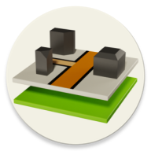
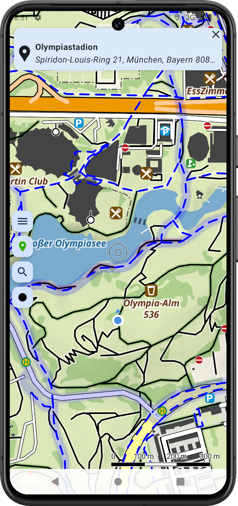

# Cyclemap App
An Android app for offline usage of vector-tiles

## Refactor for Version 3

### Features

- [x] Use latest mapbox SDK (11.x)
- [x] Save/restore last camera position
- [x] Show current location using Mapbox puck when location tracking is enabled
- [x] Crosshair centered on map and zoom on crosshair center
- [x] Interactive polyline distance measurement when clicking the crosshair
- [x] Change map style (Cyclemap, Shadow, X-Ray, Mapbox, Satellite, ...)
- [.] Load/show route (GPX) and metadata
- [.] Record current track; Show while recording; Show metadata (length, time, ...)
- [ ] Save recorded track as GPX
- [.] Show current speed while tracking
- [.] Graceful handling of device orientation changes
- [ ] Consider 
- [ ] track statistics
- [ ] clear current track
- [ ] Save Measurement as GPX
- [ ] Share map position (Link, Text)
- [ ] Favorite locations (add, delete, fly-to)

> x=done .=in progress 

## References

### General

- [Using Bluetooth GPS with Android ](https://l-36.com/bluetooth_gps_provider.php)

### Mapbox

- [Mapbox Tutorial For Android: Getting Started](https://www.raywenderlich.com/378151-mapbox-tutorial-for-android-getting-started)

### Android Programming

- [JPX - Java library for creating, reading and writing GPX data](https://github.com/jenetics/jpx)

#### Location

- [phyphox: Android](https://github.com/phyphox/phyphox-android)
- [Google Play Location Samples](https://github.com/android/location-samples)

#### RecyclerView

- [Create dynamic lists with RecyclerView](https://developer.android.com/develop/ui/views/layout/recyclerview)
- [Android RecyclerView in Kotlin](https://www.geeksforgeeks.org/android-recyclerview-in-kotlin/)
- [Simple Android RecyclerView example](https://stackoverflow.com/questions/40584424/simple-android-recyclerview-example)
